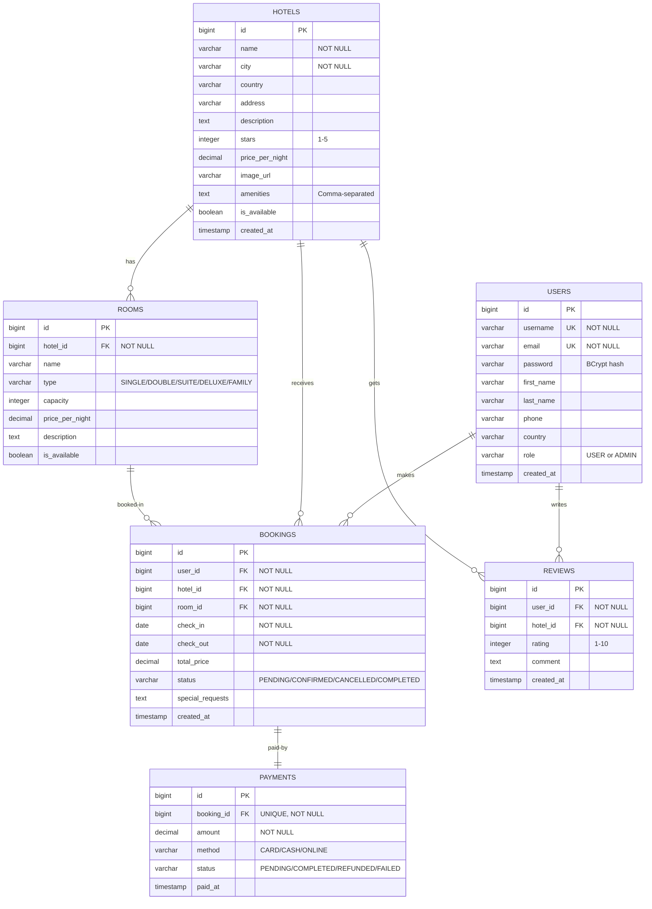

```mermaid
erDiagram
    USERS ||--o{ BOOKINGS : makes
    USERS ||--o{ REVIEWS : writes
    HOTELS ||--o{ ROOMS : has
    HOTELS ||--o{ BOOKINGS : receives
    HOTELS ||--o{ REVIEWS : gets
    ROOMS ||--o{ BOOKINGS : "booked-in"
    BOOKINGS ||--|| PAYMENTS : "paid-by"

    USERS {
        bigint id PK
        varchar username UK "NOT NULL"
        varchar email UK "NOT NULL"
        varchar password "BCrypt hash"
        varchar first_name
        varchar last_name
        varchar phone
        varchar country
        varchar role "USER or ADMIN"
        timestamp created_at
    }

    HOTELS {
        bigint id PK
        varchar name "NOT NULL"
        varchar city "NOT NULL"
        varchar country
        varchar address
        text description
        integer stars "1-5"
        decimal price_per_night
        varchar image_url
        text amenities "Comma-separated"
        boolean is_available
        timestamp created_at
    }

    ROOMS {
        bigint id PK
        bigint hotel_id FK "NOT NULL"
        varchar name
        varchar type "SINGLE/DOUBLE/SUITE/DELUXE/FAMILY"
        integer capacity
        decimal price_per_night
        text description
        boolean is_available
    }

    BOOKINGS {
        bigint id PK
        bigint user_id FK "NOT NULL"
        bigint hotel_id FK "NOT NULL"
        bigint room_id FK "NOT NULL"
        date check_in "NOT NULL"
        date check_out "NOT NULL"
        decimal total_price
        varchar status "PENDING/CONFIRMED/CANCELLED/COMPLETED"
        text special_requests
        timestamp created_at
    }

    PAYMENTS {
        bigint id PK
        bigint booking_id FK "UNIQUE, NOT NULL"
        decimal amount "NOT NULL"
        varchar method "CARD/CASH/ONLINE"
        varchar status "PENDING/COMPLETED/REFUNDED/FAILED"
        timestamp paid_at
    }

    REVIEWS {
        bigint id PK
        bigint user_id FK "NOT NULL"
        bigint hotel_id FK "NOT NULL"
        integer rating "1-10"
        text comment
        timestamp created_at
    }
```
