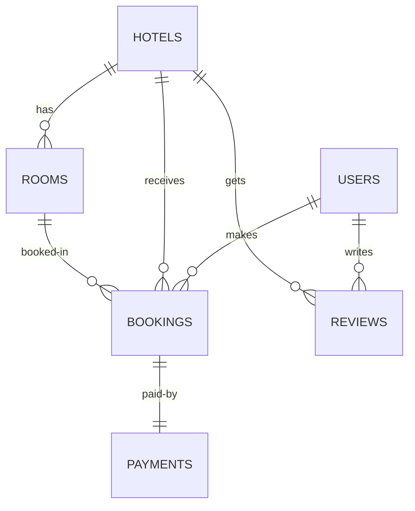

# NomadHome - Hotel Booking System

Full-stack hotel booking web application built with Java Spring Boot and PostgreSQL.

##  Project Overview

NomadHome is a comprehensive hotel reservation platform featuring JWT authentication, real-time countdown timers, AI-powered hotel recommendations, and a responsive Booking.com-style interface.

**Team Members:**
- **Alauov Aibar** - User Authentication & Security
- **Balkybek Bauyrzhan** - Hotel Management & AI Features
- **Suleiman Zharas** - Booking System & Frontend

## 🏗 System Architecture

The application follows a **3-tier architecture** with clear separation of concerns:

```
┌─────────────────────────────────────────┐
│           Browser (Client)              │
│     HTML + CSS + Vanilla JavaScript     │
└────────────────┬────────────────────────┘
                 │ HTTP/JSON + JWT
┌────────────────▼────────────────────────┐
│         Controller Layer                │
│  REST API Endpoints (@RestController)   │
└────────────────┬────────────────────────┘
                 │
┌────────────────▼────────────────────────┐
│           Service Layer                 │
│  Business Logic (@Service)              │
└────────────────┬────────────────────────┘
                 │
┌────────────────▼────────────────────────┐
│        Repository Layer                 │
│  JPA Repositories (Spring Data)         │
└────────────────┬────────────────────────┘
                 │ JDBC + PreparedStatements
┌────────────────▼────────────────────────┐
│      PostgreSQL Database                │
│  6 tables with relationships            │
└─────────────────────────────────────────┘
```

## 📊 Database Schema

**6 Entities (exceeds 3-5 requirement):**



**Tables:**
- `users` - User accounts (USER/ADMIN roles)
- `hotels` - Hotel information
- `rooms` - Hotel rooms with types
- `bookings` - Reservations with countdown timer
- `payments` - Payment records
- `reviews` - User reviews with ratings

##  Security Implementation

### 1. SQL Injection Protection
- **Spring Data JPA** with parameterized queries
- All database operations use `PreparedStatement`
- No string concatenation in SQL queries

```java
// UserRepository.java
Optional<User> findByUsername(String username);
// Generates: SELECT * FROM users WHERE username = ?
// Parameter is passed separately, preventing SQL injection
```

### 2. Password Encryption
- **BCrypt** hashing algorithm (cost factor = 10)
- Passwords stored as one-way hashes: `$2a$10$...`
- Salt automatically generated per password

```java
// AuthService.java
String hashedPassword = passwordEncoder.encode(request.getPassword());
// "user123" → "$2a$10$N9qo8uLOickgx2ZMRZoMyeIjZAgcfl7p92ldGxad68LJZdL17lhWy"
```

### 3. JWT Authentication
- Stateless authentication with JSON Web Tokens
- Token expiration: 24 hours
- `JwtAuthFilter` intercepts every request
- Tokens stored in client-side localStorage

```java
// Token structure
Header:  {"alg": "HS256", "typ": "JWT"}
Payload: {"sub": "admin", "role": "ADMIN", "exp": 1234567890}
Signature: HMACSHA256(header + payload, SECRET_KEY)
```

### 4. Role-Based Access Control
```java
// SecurityConfig.java
/api/auth/**           → Public
/api/hotels (GET)      → Public  
/api/bookings/**       → Authenticated users only
/api/admin/**          → ADMIN role only
```

## ✨ Key Features

### For Users:
- ✅ Secure registration and login
- ✅ Hotel search with filters (city, stars, price, dates)
- ✅ Room booking with automatic price calculation
- ✅ **Live countdown timer** (days until check-in/check-out)
- ✅ Booking cancellation (PENDING status only)
- ✅ Write reviews with 1-10 rating
- ✅ AI chatbot for hotel recommendations


### Special Features:
- 🤖 **AI Recommendation System** - NLP-based hotel suggestions
- ⏱️ **Countdown Timer** - Real-time days-until calculation
- 🎨 **Responsive Design** - Mobile-first approach

## 🛠️ Technology Stack

### Backend
- **Java 22**
- **Spring Boot 3.2.0**
    - Spring Web (REST API)
    - Spring Data JPA (ORM)
    - Spring Security 6.2 (JWT + BCrypt)
    - Spring Validation
- **PostgreSQL 42.6.0**
- **Hibernate 6.3.1**
- **JWT (io.jsonwebtoken 0.12.3)**
- **Lombok 1.18.30**

### Frontend
- **Thymeleaf 3.1.2** (templating)
- **HTML5 + CSS3**
- **Vanilla JavaScript ES6+**
- **Fetch API** (HTTP requests)

### Build Tools
- **Maven 3.8+**
- **HikariCP 5.0.1** (connection pooling)

## Project Structure

```
booking-system/
├── src/
│   ├── main/
│   │   ├── java/com/booking/
│   │   │   ├── BookingApplication.java          # Main entry point
│   │   │   │
│   │   │   ├── model/                           # Entities (JPA)
│   │   │   │   ├── User.java                    # User entity (implements UserDetails)
│   │   │   │   ├── Hotel.java                   # Hotel entity
│   │   │   │   ├── Room.java                    # Room entity
│   │   │   │   ├── Booking.java                 # Booking entity (countdown logic)
│   │   │   │   ├── Payment.java                 # Payment entity
│   │   │   │   ├── Review.java                  # Review entity
│   │   │   │   ├── Role.java                    # Enum: USER, ADMIN
│   │   │   │   ├── BookingStatus.java           # Enum: PENDING, CONFIRMED, etc.
│   │   │   │   ├── RoomType.java                # Enum: SINGLE, DOUBLE, SUITE, etc.
│   │   │   │   ├── PaymentMethod.java           # Enum: CARD, CASH, ONLINE
│   │   │   │   └── PaymentStatus.java           # Enum: PENDING, COMPLETED, etc.
│   │   │   │
│   │   │   ├── repository/                      # Data Access Layer
│   │   │   │   ├── UserRepository.java          # User CRUD + findByUsername
│   │   │   │   ├── HotelRepository.java         # Hotel CRUD + custom search
│   │   │   │   ├── RoomRepository.java          # Room CRUD
│   │   │   │   ├── BookingRepository.java       # Booking CRUD + user bookings
│   │   │   │   ├── PaymentRepository.java       # Payment CRUD
│   │   │   │   └── ReviewRepository.java        # Review CRUD + avg rating
│   │   │   │
│   │   │   ├── service/                         # Business Logic
│   │   │   │   ├── AuthService.java             # Registration, Login, BCrypt
│   │   │   │   ├── HotelService.java            # Hotel CRUD, Search
│   │   │   │   ├── BookingService.java          # Booking logic, Validation
│   │   │   │   ├── PaymentService.java          # Payment processing
│   │   │   │   └── ReviewService.java           # Review management
│   │   │   │
│   │   │   ├── controller/                      # REST API Endpoints
│   │   │   │   ├── AuthController.java          # POST /api/auth/register, /login
│   │   │   │   ├── HotelController.java         # Hotel CRUD endpoints
│   │   │   │   ├── BookingController.java       # Booking CRUD endpoints
│   │   │   │   ├── PaymentController.java       # Payment endpoints
│   │   │   │   ├── ReviewController.java        # Review endpoints
│   │   │   │   ├── AiController.java            # POST /api/ai/chat
│   │   │   │   └── PageController.java          # HTML page rendering
│   │   │   │
│   │   │   ├── security/                        # Security Layer
│   │   │   │   ├── JwtService.java              # JWT generation & validation
│   │   │   │   └── JwtAuthFilter.java           # Request interceptor
│   │   │   │
│   │   │   ├── config/                          # Configuration
│   │   │   │   ├── SecurityConfig.java          # Spring Security setup
│   │   │   │   └── DataInitializer.java         # Seed data (CommandLineRunner)
│   │   │   │
│   │   │   ├── dto/
│   │   │   │   ├── request/                     # Request DTOs
│   │   │   │   │   ├── LoginRequest.java
│   │   │   │   │   ├── RegisterRequest.java
│   │   │   │   │   ├── HotelRequest.java
│   │   │   │   │   ├── BookingRequest.java
│   │   │   │   │   └── ReviewRequest.java
│   │   │   │   └── response/                    # Response DTOs
│   │   │   │       ├── AuthResponse.java
│   │   │   │       ├── HotelResponse.java
│   │   │   │       ├── BookingResponse.java     # includes daysUntilFree
│   │   │   │       ├── PaymentResponse.java
│   │   │   │       └── AiResponse.java
│   │   │   │
│   │   │   ├── exception/                       # Exception Handling
│   │   │   │   ├── GlobalExceptionHandler.java  # @ControllerAdvice
│   │   │   │   ├── ResourceNotFoundException.java
│   │   │   │   └── BadRequestException.java
│   │   │   │
│   │   │   └── ai/                              # AI Module
│   │   │       └── AiRecommendationService.java # NLP-based recommendations
│   │   │
│   │   └── resources/
│   │       ├── application.properties           # Database, JWT config
│   │       │
│   │       ├── templates/                       # Thymeleaf HTML Templates
│   │       │   ├── index.html                   # Homepage (hero, search, hotels)
│   │       │   ├── login.html                   # Login page
│   │       │   ├── register.html                # Registration page
│   │       │   ├── hotels.html                  # Hotel catalog with filters
│   │       │   ├── hotel-detail.html            # Single hotel details + rooms
│   │       │   ├── search.html                  # Search results page
│   │       │   ├── bookings.html                # User bookings with countdown
│   │       │   └── profile.html                 # User profile page
│   │       │
│   │       └── static/
│   │           ├── css/
│   │           │   └── main.css                 # All styles (design system)
│   │           └── js/
│   │               └── main.js                  # All JavaScript (API calls, auth)
│   │
│   └── test/                                    # Unit & Integration tests
│
├── pom.xml                                      # Maven dependencies
├── .gitignore                                   # Git ignore rules
└── README.md                                    # This file
```

## Диаграмма системной архитектуры

┌─────────────────────────────────────────┐
│           Browser (Client)              │
│     HTML + CSS + Vanilla JavaScript     │
└────────────────┬────────────────────────┘
│ HTTP/JSON (REST API)
│ JWT Token in Header
┌────────────────▼────────────────────────┐
│         Controller Layer                │
│  ┌──────────────────────────────────┐  │
│  │ AuthController                    │  │
│  │ HotelController                   │  │
│  │ BookingController                 │  │
│  │ ReviewController, PaymentController│ │
│  │ AiController, PageController      │  │
│  └──────────────────────────────────┘  │
└────────────────┬────────────────────────┘
│
┌────────────────▼────────────────────────┐
│           Service Layer                 │
│  ┌──────────────────────────────────┐  │
│  │ AuthService (BCrypt)              │  │
│  │ HotelService                      │  │
│  │ BookingService (Countdown)        │  │
│  │ ReviewService, PaymentService     │  │
│  │ AiRecommendationService (NLP)     │  │
│  └──────────────────────────────────┘  │
└────────────────┬────────────────────────┘
│
┌────────────────▼────────────────────────┐
│        Repository Layer (JPA)           │
│  ┌──────────────────────────────────┐  │
│  │ UserRepository                    │  │
│  │ HotelRepository (@Query)          │  │
│  │ BookingRepository                 │  │
│  │ RoomRepository                    │  │
│  │ PaymentRepository, ReviewRepository│ │
│  └──────────────────────────────────┘  │
│           (PreparedStatements)          │
└────────────────┬────────────────────────┘
│ JDBC
┌────────────────▼────────────────────────┐
│      PostgreSQL Database (BookingDB)    │
│  ┌──────────────────────────────────┐  │
│  │ users, hotels, rooms              │  │
│  │ bookings, payments, reviews       │  │
│  │ (6 tables with relationships)     │  │
│  └──────────────────────────────────┘  │
└─────────────────────────────────────────┘

Security Layer (horizontal):
┌─────────────────────────────────────────┐
│  JwtAuthFilter → JwtService             │
│  SecurityConfig (Spring Security)       │
│  BCryptPasswordEncoder                  │
└─────────────────────────────────────────┘


### Prerequisites
- JDK 22+
- PostgreSQL 14+
- Maven 3.8+

### Setup Steps

1. **Clone repository**
```bash
git clone https://github.com/your-username/nomad-home.git
cd nomad-home
```

2. **Create database**
```sql
CREATE DATABASE BookingDB;
```

3. **Configure application.properties**
```properties
spring.datasource.url=jdbc:postgresql://localhost:5432/BookingDB
spring.datasource.username=postgres
spring.datasource.password=your_password
```

4. **Build and run**
```bash
mvn clean install
mvn spring-boot:run
```

5. **Access application**
```
http://localhost:8080
```

##  Test Accounts

Auto-created on first startup:

**User Account:**
- Username: `user`
- Password: `user123`
- Role: USER

**Admin Account:**
- Username: `admin`
- Password: `admin123`
- Role: ADMIN

## 📡API Endpoints

### Authentication
```http
POST /api/auth/register  - User registration
POST /api/auth/login     - User login (returns JWT)
```

### Hotels
```http
GET  /api/hotels              - Get all hotels
GET  /api/hotels/{id}         - Get hotel details
GET  /api/hotels/search       - Search with filters
POST /api/hotels              - Create hotel (ADMIN)
PUT  /api/hotels/{id}         - Update hotel (ADMIN)
DELETE /api/hotels/{id}       - Delete hotel (ADMIN)
```

### Bookings
```http
GET  /api/bookings/my         - User's bookings
POST /api/bookings            - Create booking
PUT  /api/bookings/{id}/cancel    - Cancel booking
PUT  /api/bookings/{id}/confirm   - Confirm (ADMIN)
```

### Reviews
```http
POST /api/reviews             - Create review
GET  /api/reviews/hotel/{id}  - Get hotel reviews
DELETE /api/reviews/{id}      - Delete review (ADMIN)
```

### AI Recommendations
```http
POST /api/ai/chat             - Get hotel recommendations
```

##  Core Implementation Details

### Countdown Timer Feature
```java
// Booking.java
public long getDaysUntilFree() {
    return ChronoUnit.DAYS.between(LocalDate.now(), checkOut);
}
```

Frontend updates every 60 seconds via `setInterval()` for real-time display.

### AI Recommendation System
Rule-based NLP that analyzes user queries:
- Keywords: "лучшие" → sort by rating DESC
- Keywords: "дешевые" → sort by price ASC
- City names → filter by city
- "люксовые" → filter 5-star hotels

### SQL Injection Prevention
```java
@Query("SELECT h FROM Hotel h WHERE (:city IS NULL OR LOWER(h.city) = LOWER(:city))")
List<Hotel> search(@Param("city") String city);
// @Param ensures safe parameter binding
```

##  Database Relationships

- User → Bookings: **One-to-Many**
- User → Reviews: **One-to-Many**
- Hotel → Rooms: **One-to-Many**
- Hotel → Bookings: **One-to-Many**
- Hotel → Reviews: **One-to-Many**
- Room → Bookings: **One-to-Many**
- Booking → Payment: **One-to-One**

##  Development Workflow

```bash
# Start development
mvn spring-boot:run

# Run tests
mvn test

# Build JAR
mvn clean package

# Run JAR
java -jar target/booking-system-0.0.1-SNAPSHOT.jar
```

##  Git Commit Convention

Following Conventional Commits standard:

```
feat: add new feature
fix: bug fix
docs: documentation update
style: code formatting
refactor: code refactoring
test: add tests
chore: dependency updates
```

##  Contact

- **GitHub:** https://github.com/Bauyrjan18/Booking.com.git
- **Email:** bauyrzhan.balkybek@narxoz.kz