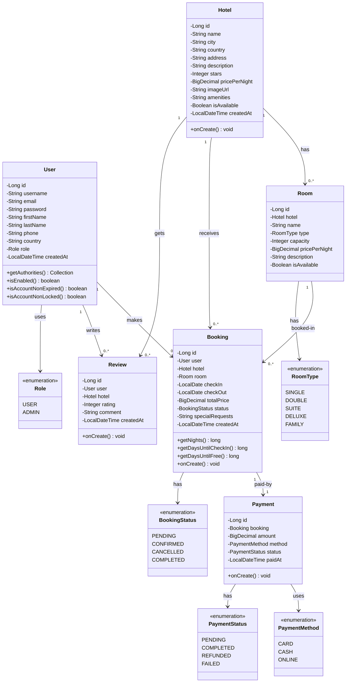

```mermaid
classDiagram
    class User {
        -Long id
        -String username
        -String email
        -String password
        -String firstName
        -String lastName
        -String phone
        -String country
        -Role role
        -LocalDateTime createdAt
        +getAuthorities() Collection
        +isEnabled() boolean
        +isAccountNonExpired() boolean
        +isAccountNonLocked() boolean
    }

    class Hotel {
        -Long id
        -String name
        -String city
        -String country
        -String address
        -String description
        -Integer stars
        -BigDecimal pricePerNight
        -String imageUrl
        -String amenities
        -Boolean isAvailable
        -LocalDateTime createdAt
        +onCreate() void
    }

    class Room {
        -Long id
        -Hotel hotel
        -String name
        -RoomType type
        -Integer capacity
        -BigDecimal pricePerNight
        -String description
        -Boolean isAvailable
    }

    class Booking {
        -Long id
        -User user
        -Hotel hotel
        -Room room
        -LocalDate checkIn
        -LocalDate checkOut
        -BigDecimal totalPrice
        -BookingStatus status
        -String specialRequests
        -LocalDateTime createdAt
        +getNights() long
        +getDaysUntilCheckIn() long
        +getDaysUntilFree() long
        +onCreate() void
    }

    class Payment {
        -Long id
        -Booking booking
        -BigDecimal amount
        -PaymentMethod method
        -PaymentStatus status
        -LocalDateTime paidAt
        +onCreate() void
    }

    class Review {
        -Long id
        -User user
        -Hotel hotel
        -Integer rating
        -String comment
        -LocalDateTime createdAt
        +onCreate() void
    }

    class Role {
        <<enumeration>>
        USER
        ADMIN
    }

    class BookingStatus {
        <<enumeration>>
        PENDING
        CONFIRMED
        CANCELLED
        COMPLETED
    }

    class RoomType {
        <<enumeration>>
        SINGLE
        DOUBLE
        SUITE
        DELUXE
        FAMILY
    }

    class PaymentMethod {
        <<enumeration>>
        CARD
        CASH
        ONLINE
    }

    class PaymentStatus {
        <<enumeration>>
        PENDING
        COMPLETED
        REFUNDED
        FAILED
    }

    User "1" --> "0..*" Booking : makes
    User "1" --> "0..*" Review : writes
    Hotel "1" --> "0..*" Room : has
    Hotel "1" --> "0..*" Booking : receives
    Hotel "1" --> "0..*" Review : gets
    Room "1" --> "0..*" Booking : booked-in
    Booking "1" --> "1" Payment : paid-by
    User --> Role : uses
    Booking --> BookingStatus : has
    Room --> RoomType : has
    Payment --> PaymentMethod : uses
    Payment --> PaymentStatus : has
```
